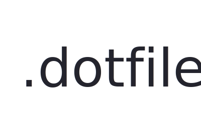

<h1 align="center">
	
</h1>

> Crisp Setups for [macOS](https://de.wikipedia.org/wiki/MacOS) - take control of your development environments

[](https://github.com/JustusDeitert/.dotfiles/releases)


[](https://github.com/JustusDeitert/.dotfiles/issues)

Spend less time on redundant things like setting up your development environment on macOS.   

## Install
1. Clone or download the Repository to your user directory ~/
```
$ cd && git clone https://github.com/JustusDeitert/.dotfiles.git
```
2. To get the Installer going we source the install.sh from within the ~/.dotfiles directory
```
$ cd ~/.dotfiles && source install.sh
```
> Thats it! The Installer will lead you trough the Installation
```
$ Do you want to install Oh My Zsh && Homebrew [y/n]
$ Do you want to install Brews: php71, mysql, etc.. [y/n]
$ Do you want to install Global Node Packages [y/n]
$ ...
$ ...
```

## Customize
Feel free to Customize the installer & add .dotfiles like `.zshrc` after your needs.

## What's included?
Here is a small list of what is going to be installed so far:

### System Setup
##### .installer/setup_system.sh
* [Oh-My-Zsh](https://ohmyz.sh/) 
* [Homebrew](https://brew.sh/)

### Brews 
##### .installer/brews.sh
* [php71](http://php.net/)
* [composer](https://getcomposer.org/)
* [mysql](https://www.mysql.com)
* [mongodb](https://www.mongodb.com)
* [node](https://nodejs.org)
* [ruby](https://www.ruby-lang.org)
* [rbenv](http://rbenv.org/)

### Node Modules 
##### .installer/node_modules.sh
* [webpack](https://webpack.js.org/)
* [grunt-cli](https://gruntjs.com)
* [gulp](https://gulpjs.com/)
* [bower](https://bower.io/)
* [yo](http://yeoman.io/)
* [generator-webapp](http://yeoman.io/generators/)
* [node-sass](https://github.com/sass/node-sass)

### Brew Casks 
##### .installer/brew_casks.sh
* [google-chrome](https://www.google.com/intl/de_ALL/chrome/)
* [firefox](https://www.mozilla.org/firefox)
* [skype](https://www.skype.com)
* [sequel-pro](https://www.sequelpro.com/)
* [github](https://desktop.github.com/)
* [transmission](https://transmissionbt.com/)
* [atom](https://atom.io/)
* [dropbox](https://www.dropbox.com)
* [appcleaner](https://freemacsoft.net/appcleaner/)
* [caffeine](http://lightheadsw.com/caffeine/)
* [vlc](https://www.vlc.de/)
* [the-unarchiver](https://theunarchiver.com/)
* [iterm2](https://iterm2.com/)
* [sketch](https://www.sketchapp.com/)
* [whatsapp](https://www.whatsapp.com/download/)
* [messenger](https://www.messenger.com/)

### Atom Packages 
##### .installer/atom_packages.sh
Atom Plugins:
* [language-apache](https://atom.io/packages/language-apache)
* [color-picker](https://atom.io/packages/color-picker)
* [autoclose-html](https://atom.io/packages/autoclose-html)
* [linter-htmlhint](https://atom.io/packages/linter-htmlhint)
* [grunt-runner](https://atom.io/packages/grunt-runner)
* [terminal-status](https://atom.io/packages/terminal-status)
* [docblockr](https://atom.io/packages/docblockr)
* [scssbundle](https://atom.io/packages/scssbundle)
* [stylus](https://atom.io/packages/stylus)
* [atom-ternjs](https://atom.io/packages/atom-ternjs)
* [minimap](https://atom.io/packages/minimap)

Atom Skins:
* [neutron-ui](https://atom.io/themes/neutron-ui)
* [neutron-syntax](https://atom.io/themes/neutron-syntax)
* [file-icons](https://atom.io/themes/file-icons)

### Symlink Creation 
##### .installer/create_symlinks.sh
Right now there is only the .zshrc dotfile to be symlinked
* .zshrc
